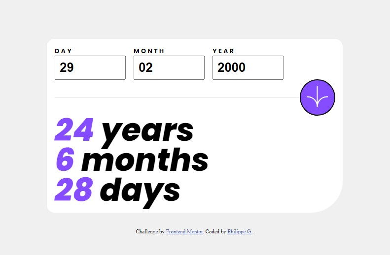

# Frontend Mentor - Age calculator app solution

This is a solution to the [Age calculator app challenge on Frontend Mentor](https://www.frontendmentor.io/challenges/age-calculator-app-dF9DFFpj-Q). Frontend Mentor challenges help you improve your coding skills by building realistic projects.

## Table of contents

- [Frontend Mentor - Age calculator app solution](#frontend-mentor---age-calculator-app-solution)
  - [Table of contents](#table-of-contents)
  - [Overview](#overview)
    - [The challenge](#the-challenge)
    - [Screenshot](#screenshot)
    - [Links](#links)
  - [My process](#my-process)
    - [Built with](#built-with)
    - [What I learned](#what-i-learned)
    - [Continued development](#continued-development)
    - [Useful resources](#useful-resources)
  - [Author](#author)
  - [Acknowledgments](#acknowledgments)

**Note: Delete this note and update the table of contents based on what sections you keep.**

## Overview

### The challenge

Users should be able to:

- View an age in years, months, and days after submitting a valid date through the form
- Receive validation errors if:
  - Any field is empty when the form is submitted
  - The day number is not between 1-31
  - The month number is not between 1-12
  - The year is in the future
  - The date is invalid e.g. 31/04/1991 (there are 30 days in April)
- View the optimal layout for the interface depending on their device's screen size
- See hover and focus states for all interactive elements on the page


### Screenshot



### Links

- Live Site URL: [Add live site URL here](https://your-live-site-url.com)

## My process

### Built with

- Semantic HTML5 markup
- CSS custom properties
- Flexbox
- Mobile-first workflow

### What I learned

- How to calculate date difference manualy to the day.
- How to validate a date (leap year included).
  ```js
  // Enjoy this leap year code
	if (inputs.month.value == 2 &&
		inputs.day.value == 29 &&
		!(inputs.year.value % 400 == 0 ||
			(inputs.year.value % 4 == 0 && inputs.year.value % 100 != 0))) {
		inputs.day.nextElementSibling.innerHTML = objErrorMsg.not_leap;
		return false;
	}
  ```

### Continued development

Now that the logic works, it could be good to add some animation when recalculating a date

### Useful resources

- [Mozilla Dev - Date](https://developer.mozilla.org/en-US/docs/Web/JavaScript/Reference/Global_Objects/Date) - I Needed more info on how the Date object can be used to complete this task

## Author

- Frontend Mentor - [@yourusername](https://www.frontendmentor.io/profile/Z0ul0u25)

## Acknowledgments

This is my first Frontend Mentor project. I mainly wanted to test the water and do something relatively simple for my skillset.
